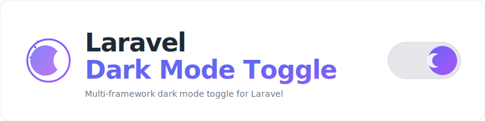

<p align="center">
    <picture>
        <source media="(prefers-color-scheme: dark)" srcset="art/banner-dark.svg">
        <source media="(prefers-color-scheme: light)" srcset="art/banner-light.svg">
        
    </picture>
</p>

<p align="center">
A standalone dark mode toggle component for Laravel with Light, Dark, and System modes,<br>localStorage persistence, optional server-side sync, and full CSS/frontend framework parity.
</p>

<p align="center">
    <a href="https://packagist.org/packages/jeremykenedy/laravel-darkmode-toggle"></a>
    <a href="https://packagist.org/packages/jeremykenedy/laravel-darkmode-toggle"></a>
    <a href="https://github.com/jeremykenedy/laravel-darkmode-toggle/actions"></a>
    <a href="https://github.styleci.io/repos/1194798386?branch=main"></a>
    <a href="https://opensource.org/licenses/MIT"></a>
</p>

## Table of Contents

- [Framework Support](#framework-support)
- [Requirements](#requirements)
- [Installation](#installation)
- [Quick Start](#quick-start)
- [Features](#features)
- [Configuration](#configuration)
- [Server-Side Persistence](#server-side-persistence)
- [Changing Frameworks](#changing-frameworks)
- [Artisan Commands](#artisan-commands)
- [How It Works](#how-it-works)
- [Testing](#testing)
- [License](#license)

## Framework Support

Every CSS and frontend combination is fully supported with identical features:

|                 | Blade + Alpine.js  |     Livewire 3     |       Vue 3        |      React 18      |      Svelte 4      |
| --------------- | :----------------: | :----------------: | :----------------: | :----------------: | :----------------: |
| **Tailwind v4** | :white_check_mark: | :white_check_mark: | :white_check_mark: | :white_check_mark: | :white_check_mark: |
| **Bootstrap 5** | :white_check_mark: | :white_check_mark: | :white_check_mark: | :white_check_mark: | :white_check_mark: |
| **Bootstrap 4** | :white_check_mark: | :white_check_mark: | :white_check_mark: | :white_check_mark: | :white_check_mark: |

**15 combinations. Zero feature gaps.**

## Requirements

- PHP 8.2+
- Laravel 12 or 13
- One CSS framework: Tailwind v4, Bootstrap 5, or Bootstrap 4
- One frontend: Blade + Alpine.js, Livewire 3, Vue 3, React 18, or Svelte 4

## Installation

```bash
composer require jeremykenedy/laravel-darkmode-toggle
php artisan darkmode:install
```

The interactive installer will prompt you to select your CSS and frontend frameworks.

### Non-Interactive Install

```bash
php artisan darkmode:install --css=tailwind --frontend=blade
```

> **Note:** If the package is already installed, the install command will warn you and recommend using `darkmode:update` instead. You can force a fresh reinstall with `--force`, but this will overwrite your config and published views.

## Quick Start

### 1. Add the init script to `<head>`

Prevents flash of wrong theme on page load:

```html
<head>
    @include('darkmode::init-script')
</head>
```

### 2. Add the toggle component

**Blade (with Alpine.js):**
```html
<x-darkmode-toggle />
```

**Livewire:**
```html
<livewire:darkmode-toggle />
```

**Vue:**
```vue
<script setup>
import DarkmodeToggle from './vendor/darkmode-toggle/DarkmodeToggle.vue'
</script>

<template>
    <DarkmodeToggle persist-url="/darkmode/preference" />
</template>
```

**React:**
```jsx
import DarkmodeToggle from './vendor/darkmode-toggle/DarkmodeToggle'

export default function Nav() {
    return <DarkmodeToggle persistUrl="/darkmode/preference" />
}
```

**Svelte:**
```svelte
<script>
import DarkmodeToggle from './vendor/darkmode-toggle/DarkmodeToggle.svelte'
</script>

<DarkmodeToggle persistUrl="/darkmode/preference" />
```

## Features

- **Three modes**: Light, Dark, System (follows OS preference)
- **Instant switching**: Persists to `localStorage`, no page reload
- **FOUC prevention**: Init script runs synchronously in `<head>` before paint
- **Server-side sync**: Optionally saves preference to user profile via PUT/POST
- **Class-based**: Adds/removes `dark` class on `<html>` element
- **System tracking**: Listens for OS preference changes in real time
- **Configurable**: Every aspect via `config/darkmode.php` and ENV variables

## Configuration

```bash
php artisan vendor:publish --tag=darkmode-config
```

Key options in `config/darkmode.php`:

| Option | Default | Description |
|--------|---------|-------------|
| `strategy` | `class` | Dark mode strategy |
| `class_name` | `dark` | Class added to `<html>` |
| `default` | `system` | Default mode (light/dark/system) |
| `storage_key` | `theme` | localStorage key |
| `persist_to_server` | `true` | Save to DB when authenticated |
| `persist_route` | `/profile/dark-mode` | Server persistence endpoint |
| `persist_method` | `PUT` | HTTP method for persistence |
| `persist_field` | `dark_mode` | Request/DB field name |
| `css_framework` | `null` | null = inherit from `ui-kit.css_framework` |

## Server-Side Persistence

The package includes a route `PUT /darkmode/preference` that saves the preference to the user's profile. To use your own route:

```php
'persist_route' => '/profile/dark-mode',
'routes' => ['enabled' => false],
```

The toggle sends a JSON request:

```json
{ "dark_mode": "dark" }
```

## Changing Frameworks

After initial installation, use the **update** or **switch** commands to change your CSS or frontend framework without losing your configuration.

### Update (Interactive)

The update command shows the same stepped prompts as the installer, letting you walk through framework selection:

```bash
php artisan darkmode:update
```

Or pass options directly:

```bash
php artisan darkmode:update --css=bootstrap5
php artisan darkmode:update --frontend=vue
php artisan darkmode:update --css=tailwind --frontend=livewire
```

### Switch (Quick)

The switch command is a shorthand for changing one or both frameworks in a single command:

```bash
php artisan darkmode:switch --css=bootstrap5
php artisan darkmode:switch --frontend=livewire
php artisan darkmode:switch --css=tailwind --frontend=vue
```

Both commands update your `.env` file and clear the config/view caches. After switching, run:

```bash
npm run build
```

## Artisan Commands

| Command | Description |
|---------|-------------|
| `darkmode:install` | Fresh install with interactive prompts. Detects existing installation and warns before overwriting. |
| `darkmode:update` | Update framework selection with interactive prompts. Safe, does not overwrite config. |
| `darkmode:switch` | Quick framework switch via flags. `--css` and/or `--frontend` required. |

### Install Options

| Flag | Description |
|------|-------------|
| `--css=` | CSS framework: `tailwind`, `bootstrap5`, `bootstrap4` |
| `--frontend=` | Frontend: `blade`, `livewire`, `vue`, `react`, `svelte` |
| `--force` | Skip reinstall confirmation when already installed |

## How It Works

1. **Init script** runs synchronously in `<head>`, reads `localStorage`, adds `dark` class before paint
2. **Toggle component** renders sun/moon/monitor icons with dropdown for Light/Dark/System
3. **On selection**: updates `localStorage`, toggles HTML class, optionally PUTs to server
4. **System mode**: listens for `prefers-color-scheme` media query changes in real time

## Testing

```bash
./vendor/bin/pest --ci
```

## License

This package is open-sourced software licensed under the [MIT license](LICENSE).
