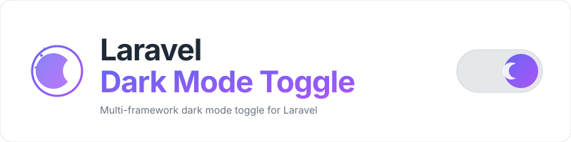

<p align="center">
    <picture>
        <source media="(prefers-color-scheme: dark)" srcset="art/banner-dark.svg">
        <source media="(prefers-color-scheme: light)" srcset="art/banner-light.svg">
        
    </picture>
</p>

<p align="center">
A standalone dark mode toggle component for Laravel with Light, Dark, and System modes,<br>localStorage persistence, optional server-side sync, and full CSS/frontend framework parity.
</p>

<p align="center">
    <a href="https://packagist.org/packages/jeremykenedy/laravel-darkmode-toggle"></a>
    <a href="https://packagist.org/packages/jeremykenedy/laravel-darkmode-toggle"></a>
    <a href="https://github.com/jeremykenedy/laravel-darkmode-toggle/actions"></a>
    <a href="https://github.styleci.io/repos/1194798386?branch=main"></a>
    <a href="https://opensource.org/licenses/MIT"></a>
</p>

## Table of Contents

- [Framework Support](#framework-support)
- [Requirements](#requirements)
- [Installation](#installation)
- [Quick Start](#quick-start)
- [Features](#features)
- [Configuration](#configuration)
- [Environment Variables](#environment-variables)
- [CSS Framework Notes](#css-framework-notes)
- [JavaScript Components](#javascript-components)
- [Server-Side Persistence](#server-side-persistence)
- [Accessibility](#accessibility)
- [Translations](#translations)
- [Changing Frameworks](#changing-frameworks)
- [Artisan Commands](#artisan-commands)
- [How It Works](#how-it-works)
- [Testing](#testing)
- [Upgrading](#upgrading)
- [License](#license)

## Framework Support

Every CSS and frontend combination is supported with the same feature set.

|                 | Blade + Alpine.js | Livewire 3 | Vue 3 | React 18 | Svelte 4 |
| --------------- | :---------------: | :--------: | :---: | :------: | :------: |
| **Tailwind v4** |        Yes        |    Yes     |  Yes  |   Yes    |   Yes    |
| **Bootstrap 5** |        Yes        |    Yes     |  Yes  |   Yes    |   Yes    |
| **Bootstrap 4** |        Yes        |    Yes     |  Yes  |   Yes    |   Yes    |

15 combinations. No feature gaps.

## Requirements

- PHP 8.2 or newer
- Laravel 12 or 13
- One CSS framework: Tailwind v4, Bootstrap 5, or Bootstrap 4
- One frontend: Blade + Alpine.js, Livewire 3, Vue 3, React 18, or Svelte 4

`composer.json` still allows Laravel 10 and 11 so existing installs are not cut off. Composer no
longer installs either branch: every 10.x and 11.x release is affected by CVE-2026-48019 and
neither branch received a patched release, so Composer blocks them. CI covers Laravel 12 and 13
on PHP 8.2 through 8.5.

Livewire is optional. It is only needed if you pick the Livewire frontend, and the package
registers its Livewire component only when Livewire is present.

## Installation

```bash
composer require jeremykenedy/laravel-darkmode-toggle
php artisan darkmode:install
```

The installer prompts for your CSS and frontend frameworks.

### Non-Interactive Install

```bash
php artisan darkmode:install --css=tailwind --frontend=blade
```

If the package is already installed, the install command stops and points you at
`darkmode:update`. You can force a fresh reinstall with `--force`, which overwrites your config
and published views.

## Quick Start

### 1. Add the init script to `<head>`

This runs before paint and prevents a flash of the wrong theme:

```blade
<head>
    @include('darkmode::init-script')
</head>
```

### 2. Add the toggle component

**Blade (with Alpine.js):**
```blade
<x-darkmode-toggle />
```

**Livewire:**
```blade
<livewire:darkmode-toggle />
```

**Vue:**
```vue
<script setup>
import DarkmodeToggle from '@/vendor/darkmode-toggle/vue/DarkmodeToggle.vue'
</script>

<template>
    <DarkmodeToggle persist-url="/darkmode/preference" />
</template>
```

**React:**
```jsx
import DarkmodeToggle from '@/vendor/darkmode-toggle/react/DarkmodeToggle'

export default function Nav() {
    return <DarkmodeToggle persistUrl="/darkmode/preference" />
}
```

**Svelte:**
```svelte
<script>
import DarkmodeToggle from '@/vendor/darkmode-toggle/svelte/DarkmodeToggle.svelte'
</script>

<DarkmodeToggle persistUrl="/darkmode/preference" />
```

Publish the JavaScript components first, see [JavaScript Components](#javascript-components).

## Features

- **Three modes**: Light, Dark, System (follows the operating system)
- **Instant switching**: persists to `localStorage`, no page reload
- **No flash**: the init script runs synchronously in `<head>` before paint
- **Server-side sync**: optionally saves the preference to the signed in user's profile
- **Class based**: adds and removes the `dark` class on `<html>`
- **System tracking**: follows `prefers-color-scheme` changes in real time
- **Keyboard and screen reader support**: see [Accessibility](#accessibility)
- **Translatable**: every label comes from the package language files
- **Optional extras**: a data attribute for Bootstrap 5.3, the CSS `color-scheme` property, and
  cross tab sync, all off by default

## Configuration

```bash
php artisan vendor:publish --tag=darkmode-config
```

| Option | Default | Description |
|--------|---------|-------------|
| `strategy` | `class` | Dark mode strategy |
| `class_name` | `dark` | Class added to `<html>` |
| `data_attribute` | `null` | Extra attribute set on `<html>` to `dark` or `light`, for example `data-bs-theme` |
| `color_scheme` | `false` | Mirror the theme onto the CSS `color-scheme` property |
| `default` | `system` | Default mode: `light`, `dark` or `system` |
| `storage_key` | `theme` | localStorage key |
| `sync_across_tabs` | `false` | Update other open tabs when the theme changes |
| `persist_to_server` | `true` | Save to the database when a user is signed in |
| `persist_route` | `/profile/dark-mode` | Endpoint the toggle posts to |
| `persist_method` | `PUT` | HTTP method used for persistence |
| `persist_field` | `dark_mode` | Request and database field name |
| `css_framework` | `null` | `null` inherits from `ui-kit.css_framework` |
| `frontend` | `null` | `null` inherits from `ui-kit.frontend` |
| `prefix` | `darkmode` | View namespace, `darkmode::toggle` |
| `routes.enabled` | `true` | Register the package route |
| `routes.prefix` | `darkmode` | Route prefix |
| `routes.middleware` | `['web', 'auth']` | Route middleware |

`data_attribute`, `color_scheme` and `sync_across_tabs` are off by default so an existing install
behaves exactly as it did before.

## Environment Variables

Every option reads from the environment, so you can change behaviour per environment without
publishing the config.

| Variable | Option |
|----------|--------|
| `DARKMODE_STRATEGY` | `strategy` |
| `DARKMODE_CLASS` | `class_name` |
| `DARKMODE_DATA_ATTRIBUTE` | `data_attribute` |
| `DARKMODE_COLOR_SCHEME` | `color_scheme` |
| `DARKMODE_DEFAULT` | `default` |
| `DARKMODE_STORAGE_KEY` | `storage_key` |
| `DARKMODE_SYNC_TABS` | `sync_across_tabs` |
| `DARKMODE_PERSIST` | `persist_to_server` |
| `DARKMODE_PERSIST_ROUTE` | `persist_route` |
| `DARKMODE_PERSIST_METHOD` | `persist_method` |
| `DARKMODE_PERSIST_FIELD` | `persist_field` |
| `DARKMODE_CSS` | `css_framework` |
| `DARKMODE_FRONTEND` | `frontend` |
| `DARKMODE_PREFIX` | `prefix` |
| `DARKMODE_ROUTES_ENABLED` | `routes.enabled` |
| `DARKMODE_ROUTES_PREFIX` | `routes.prefix` |

## CSS Framework Notes

### Tailwind v4

Tailwind v4 uses the media query for `dark:` by default. Add this to your CSS so it follows the
class the toggle sets:

```css
@custom-variant dark (&:where(.dark, .dark *));
```

### Bootstrap 5.3

Bootstrap 5.3 drives its own dark mode from `data-bs-theme` on `<html>` rather than a class. Set
the data attribute so Bootstrap components follow the toggle:

```php
'data_attribute' => 'data-bs-theme',
```

The `dark` class is still applied, so your own `.dark` styles keep working.

### Bootstrap 4

Bootstrap 4 has no built in dark mode. Style against the `dark` class:

```css
html.dark body { background: #161615; color: #EDEDEC; }
```

## JavaScript Components

Publish the Vue, React, and Svelte components:

```bash
php artisan vendor:publish --tag=darkmode-js
```

They land in `resources/js/vendor/darkmode-toggle/`. They are plain single file components with
no build configuration of their own.

| Prop | Default | Description |
|------|---------|-------------|
| `defaultMode` | `system` | Mode used before localStorage is read |
| `storageKey` | `theme` | localStorage key |
| `persistUrl` | `''` | Endpoint to post the preference to, empty disables it |
| `persistMethod` | `PUT` | HTTP method |
| `persistField` | `dark_mode` | Field name in the request body |
| `className` | `dark` | Class toggled on `<html>` |
| `dataAttribute` | `''` | Attribute set on `<html>`, for example `data-bs-theme` |
| `colorScheme` | `false` | Mirror the theme onto the CSS `color-scheme` property |
| `toggleLabel` | `Toggle theme` | Accessible label for the trigger |
| `labels` | `{ light, dark, system }` | Labels for the three options |

Pass your own translations through `toggleLabel` and `labels`.

## Server-Side Persistence

When `persist_to_server` is on and a user is signed in, choosing a mode posts to `persist_route`:

```json
{ "dark_mode": "dark" }
```

The package registers `PUT /darkmode/preference` (named `darkmode.update`) behind the `web` and
`auth` middleware. It writes the value to the user's `profile` relation, which is the convention
used by the `laravel-ui-kit` packages. Applications without that relation get a successful
response and nothing is written, so nothing breaks.

To handle persistence yourself, point the toggle at your own endpoint and turn the package route
off:

```php
'persist_route' => '/profile/dark-mode',
'routes' => ['enabled' => false],
```

If you change `persist_method`, point `persist_route` at your own route as well. The built in
route only accepts `PUT`.

## Accessibility

The toggle follows the ARIA menu button pattern:

- The trigger carries `aria-haspopup`, `aria-expanded` and a translated `aria-label`
- The menu is `role="menu"` and each option is `role="menuitemradio"` with `aria-checked`
- `Escape` closes the menu and returns focus to the trigger
- `ArrowDown` and `ArrowUp` open the menu and move between options
- Options have visible focus styles
- Icons are `aria-hidden`, so a screen reader reads the label rather than the icon

## Translations

```bash
php artisan vendor:publish --tag=darkmode-lang
```

Keys live in `lang/vendor/darkmode/en/darkmode.php`:

```php
return [
    'light'        => 'Light',
    'dark'         => 'Dark',
    'system'       => 'System',
    'toggle_theme' => 'Toggle theme',
    'appearance'   => 'Appearance',
    'select_theme' => 'Select a theme',
];
```

## Changing Frameworks

After installation, use **update** or **switch** to change frameworks without losing your
configuration.

### Update (Interactive)

The update command shows the same stepped prompts as the installer:

```bash
php artisan darkmode:update
```

Or pass options directly:

```bash
php artisan darkmode:update --css=bootstrap5
php artisan darkmode:update --frontend=vue
php artisan darkmode:update --css=tailwind --frontend=livewire
```

### Switch (Quick)

Switch is the shorthand for changing one or both frameworks in a single command:

```bash
php artisan darkmode:switch --css=bootstrap5
php artisan darkmode:switch --frontend=livewire
php artisan darkmode:switch --css=tailwind --frontend=vue
```

Both commands update your `.env` file and clear the config and view caches. After switching, run:

```bash
npm run build
```

## Artisan Commands

| Command | Description |
|---------|-------------|
| `darkmode:install` | Fresh install with interactive prompts. Detects an existing installation and warns before overwriting. |
| `darkmode:update` | Update framework selection with interactive prompts. Does not overwrite your config. |
| `darkmode:switch` | Quick framework switch by flag. `--css` and/or `--frontend` required. |

### Options

| Flag | Commands | Description |
|------|----------|-------------|
| `--css=` | install, update, switch | `tailwind`, `bootstrap5`, `bootstrap4` |
| `--frontend=` | install, update, switch | `blade`, `livewire`, `vue`, `react`, `svelte` |
| `--force` | install | Skip the reinstall confirmation |

All three commands run without prompts when both flags are passed, so they work in deploy
scripts.

### Publish Tags

| Tag | Publishes |
|-----|-----------|
| `darkmode-config` | `config/darkmode.php` |
| `darkmode-views` | `resources/views/vendor/darkmode` |
| `darkmode-lang` | `lang/vendor/darkmode` |
| `darkmode-js` | `resources/js/vendor/darkmode-toggle` |

## How It Works

1. The init script runs synchronously in `<head>`, reads `localStorage` and sets the class
   before the first paint.
2. The toggle renders sun, moon, or monitor icons with a menu for Light, Dark, and System.
3. Choosing a mode writes to `localStorage`, updates `<html>`, and posts to the server when
   persistence is on and a user is signed in.
4. In System mode the toggle follows `prefers-color-scheme` changes as they happen.

Storage access is wrapped in `try`/`catch`, so the toggle still works when a browser blocks
`localStorage`.

## Testing

```bash
composer test
composer lint
composer analyse
```

The suite covers the component, the Livewire component, the controller and routes, all three
CSS frameworks, the init script, the JavaScript components, every install, update and switch
combination, and a backwards compatibility contract that pins the public API.

## Upgrading

See [CHANGELOG.md](CHANGELOG.md). No release has required a code change in a consuming
application.

## License

This package is open-sourced software licensed under the [MIT license](LICENSE).
